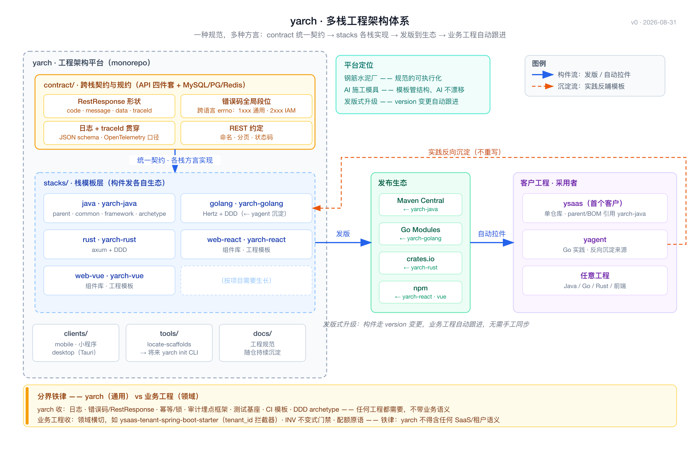
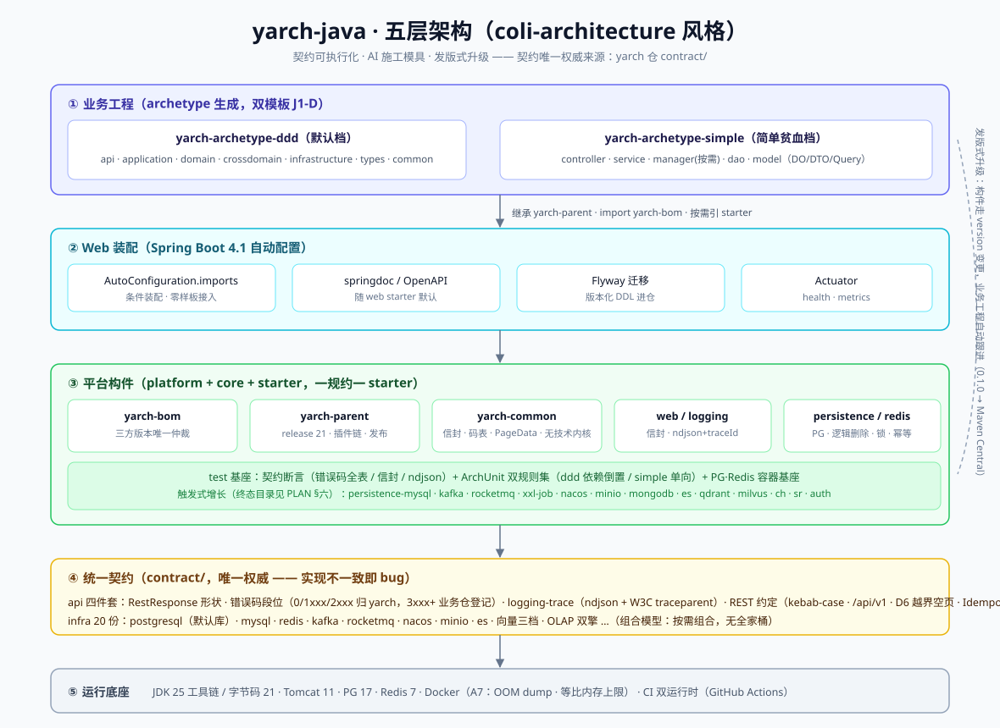
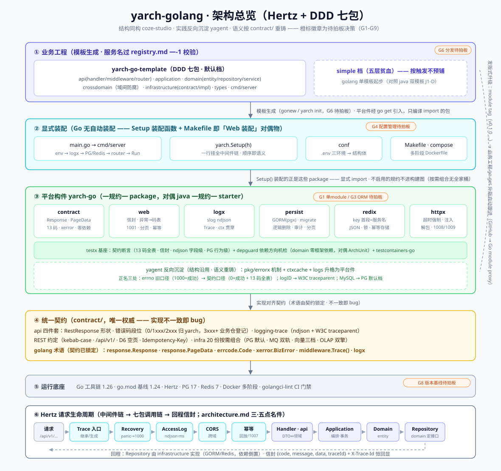
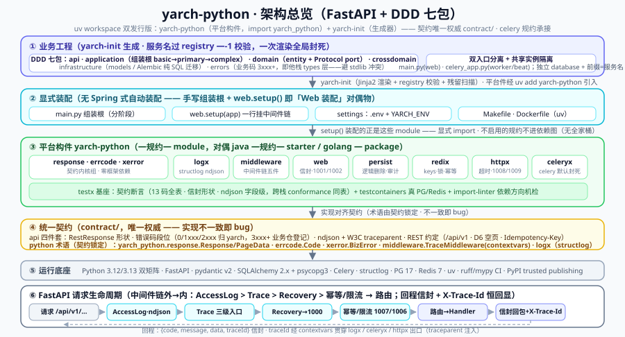
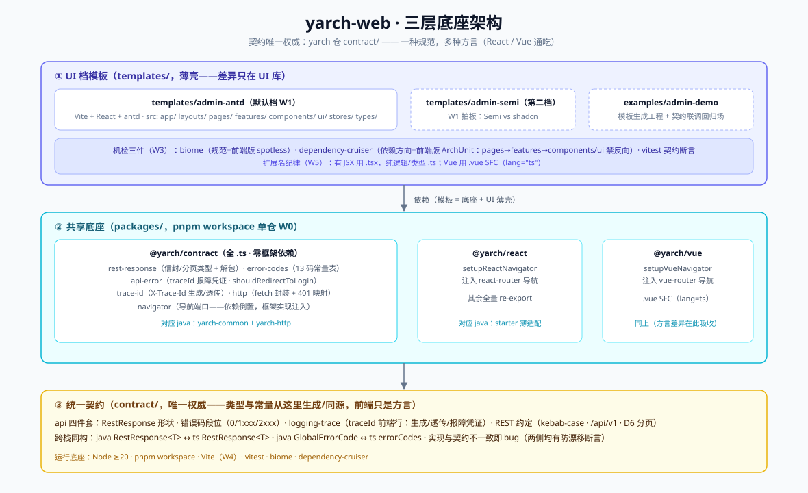

# yarch · 工程架构设计

> Yuan's Architecture —— 云-边-端全域工程架构平台：一个契约内核，N 个领域 × M 种语言方言。  
> 2026-08-31 定稿（本文件是工程结构的权威落盘）；2026-09-03 定位升全域并扩展栈规划

## 一、定位

yarch 是跨项目复用的**工程架构平台**（个人开源项目），2026-09-03 起定位升级为**云-边-端全域**：

- **钢筋水泥厂**：规范的可执行化（parent 插件 / CI 门禁 / archetype 固定结构），而非文档自觉；
- **AI 施工的模具**：skill 管规范、模板管结构，AI 生成代码不漂移；
- **发版式升级**：平台构件走 version 变更，业务工程自动跟进，不手工同步；
- **全域分层**：云端业务工程（`stacks/`，DDD+REST 语义只在此层成立）+ 交互端（`clients/`）+ 物理端固件（`embedded/`，守 device 领域契约）。

ysaas 是第一个客户；任何 Java/Go/Rust/Python/Node/前端工程都可以是客户。

## 二、核心设计：契约层（contract/）

多栈脚手架的灵魂不是每栈一套模板，而是**语言无关的统一契约**——各栈长得不一样没关系，必须说同一种接口语言：

| 契约 | 内容 | 收益 |
|---|---|---|
| RestResponse 形状 | code/message/data/traceId 的 schema | Java 与 Go 返回同构，前端一套适配 |
| 错误码全局段位 | 一张跨语言 errno 段位表（如 1xxx 通用、2xxx IAM…） | yagent 报错与 ysaas 报错语义同源 |
| 日志 + trace | 统一 JSON schema + traceId 贯穿（OpenTelemetry 口径） | 跨栈排障一条链拉通 |
| REST 约定 | 命名/分页/状态码 | 各栈 API 无方言 |

契约层已扩展收录数据与中间件规约：`infra/` 共 18 份（索引见 [../contract/README.md](../contract/README.md)）**全部 20 份已定稿 v1.0（2026-09-01 评审通过；higress 已对照官方文档校准）**：mysql、postgresql、mongodb、redis、redisearch、timescale、pgvector、qdrant、milvus、kafka、rocketmq、nacos、nginx、higress、elasticsearch、clickhouse、starrocks、minio-s3、xxl-job、celery；规约组合与依赖模型（前置硬 / 参考软 / 互斥分工）见 [../contract/README.md](../contract/README.md)。关键架构决策（MQ 双轨 / OLAP 双引擎 / 向量起步 pgvector / 网关分工 / 默认 PostgreSQL）与规约治理（等级定义、豁免与变更流程）**唯一登记处为 [../contract/README.md](../contract/README.md)**；服务名（租户边界标识）登记处为 [../contract/registry.md](../contract/registry.md)。

**领域契约（`domains/`，2026-09-03 新设层级）**：机器人、AI 等新领域的唯一进门通道——先立领域契约评审定稿，再做至少两个语言侧实现（单一实现不成领域）。首发规划：`device.md`（设备接入：MQTT topic 约定 / 遥测 schema 复用 api/logging-trace 的 JSON 口径 / OTA 包格式）、`ai.md`（LLM 接入：流式响应 / token 计费 / prompt 与 RAG 管道约定）。均未成文，启动前按工作流先出决策清单。

## 三、仓库结构

```
yarch/
├── contract/                  # 跨栈契约与规约（语言无关，唯一权威）
│   ├── api/                   # RestResponse / errno 段位 / log+trace / REST 四件套
│   ├── infra/                 # 数据与中间件规约 20 份
│   ├── web/                   # 前端规约（微前端 v1.0，2026-09-07 设立）
│   └── domains/               # 【规划】领域契约：device / ai 首发（新领域唯一进门通道）
├── stacks/                    # 云端业务工程方言层（DDD+REST 语义只在这层成立）
│   ├── java/                  # yarch-java：parent/dependencies/common/framework/archetype → Maven Central（kotlin 拟作本栈第二 archetype，不独立发栈）
│   ├── golang/                # yarch-golang：Hertz+DDD → Go module（从 yagent 反向沉淀）
│   ├── web/                   # yarch-web：pnpm workspace（contract 契约包 + react/vue 适配 + UI 档模板）→ npm
│   ├── rust/                  # yarch-rust：axum+DDD → crates.io（触发式）
│   ├── python/                # yarch-python：FastAPI+DDD → PyPI（第一批已交付 2026-09-07）
│   └── node/                  # yarch-node：NestJS+DDD → npm（正式入册，待启动）
├── clients/                   # 交互端（按项目需要生长；契约适配对偶 web 的 @yarch/contract）
│   ├── mobile/                # android：Kotlin+Jetpack Compose ｜ ios：Swift+SwiftUI（均触发式规划）；跨端备选 uni-app（兼小程序）/ Flutter
│   ├── miniprogram/           # 小程序
│   └── desktop/               # Tauri（Rust+Web，兼 Rust 练手落点）
├── embedded/                  # 【规划】物理端固件方言：esp32 起步，守 device 领域契约（C/C++ 由此门进入，不设业务栈）
├── tools/
│   └── locate-scaffolds.cjs   # 模板定位器（将来长成 yarch init CLI，全栈统一门面）
└── docs/                      # 工程规范
```

## 三·五、架构图

**平台总览**（contract → stacks → 发布生态 → 客户工程）：



**各栈脚手架详细图**（每栈一张，随栈 README 展示）：

Java（五层架构：业务工程 / Web 装配 / 平台构件 / 统一契约 / 运行底座 + 发版与升级链路，coli-architecture 风格）：



Golang（pkg 构件 + Hertz 请求生命周期）：



Python（module 构件 + FastAPI 请求生命周期）：



web（包模块 + 一次请求的数据流）：



> Rust（crate 模块 + axum 接入与请求流）：触发式规划未建栈，随栈落地后补图。

## 四、横切件分界线（yarch vs 业务工程）

| 归宿 | 收什么 | 判断标准 |
|---|---|---|
| **yarch**（通用） | 日志、错误码/RestResponse、幂等/锁、审计埋点框架、测试基座、CI 模板、DDD archetype | 任何工程都需要，不带业务语义 |
| **业务工程**（如 ysaas） | 领域横切，如 ysaas-tenant-spring-boot-starter（tenant_id 拦截器）、INV 不变式门禁、配额原语 | 一出现就带领域语义 |

铁律：yarch 不得包含任何 SaaS/租户语义。

## 五、命名规范

- starter 一律第三方式后缀：`yarch-logging-spring-boot-starter`（官方 `spring-boot-starter-*` 是保留位，勿占）；
- groupId：`io.github.ydonghao`（Central Portal 经 GitHub 验证；将来域名到位换 `dev.yarch`）；
- 生态坐标 `yarch` 均查净：GitHub / Maven Central / npm / crates.io（2026-08-31）；PyPI / NuGet / Packagist / RubyGems（2026-09-03，后三者随 dotnet/php 裁撤暂不启用）；GitHub 唯一同名为 alfa-laboratory 的 iOS 架构（小写 yarch + topics 消歧）。

## 六、施工节奏（跟项目走，不为完整性铺摊子）

**当前策略（2026-09-01 调整）：规约层先行。**

1. ~~第一步：`contract/` 四件套梳理清楚、评审定稿~~ ✅ 2026-09-01 定稿 v1.0（D1-D6 按"业界标准优先于阿里手册"拍板）；infra 规约 18 份同步成文（3 定稿 + 15 草案）；
2. **第二批**：`stacks/java` + `stacks/web`（规划期名 web-react，落位时合并为一目录；ysaas 硬需求）✅；
3. **第三批**：`stacks/golang`——从 yagent 既有实践反向沉淀，不重写 ✅（2026-09-02 第一批构件落地：结构同构 coze-studio、语义按契约重铸，三 module 全绿）；
4. **按需**：rust / clients / archetype（`yarch init`）；
5. **全域扩展（2026-09-03 拍板；dotnet / php 经评审裁撤不纳入）**：
   - 新正式栈：`stacks/python`（先行——celery 规约在等承接）✅（2026-09-07 第一批交付：契约内核 + logx/middleware/web/persist/redix/httpx + celeryx 承接 + testx + 生成器/模板，uv workspace 双发行版全绿）、`stacks/node`（NestJS，与 web 同生态共享工具链）；
   - 领域契约首发：`contract/domains/device.md`、`ai.md`（各先出决策清单评审，未成文）；
   - `embedded/esp32` 固件模板（守 device 契约；C/C++ 不设业务栈，以此形态进入）；
   - kotlin 不独立发栈，作为 java 栈第二 archetype；
   - **移动端原生双轨入册（2026-09-03 追加）**：`clients/mobile/android`（Kotlin + Jetpack Compose）、`clients/mobile/ios`（Swift + SwiftUI），触发式——登记触发为 microduck 配套 App；各带契约适配件（RestResponse 解码 / errno 段位 / X-Trace-Id 透传），适配件可分别发 Maven Central（AAR）/ Swift Package Manager；跨端备选 uni-app / Flutter 同槽位触发式，启用时原生与跨端二选一，不做四轨并维；
6. **全域治理护栏（2026-09-03 定稿）**：
   - **触发登记制**：无触发条件的栈不进规划；占位栈不建目录，只在文档留名；
   - **最低维护标准**：CI 全绿 + 一行命令起工程 + 发版链路活；连续两个季度不达标降级 archived（目录保留、移出支持列表）；
   - **方言一致性机检**：RestResponse 形状 / errno 段位 / trace schema 的跨栈 conformance 测试随 CI 跑，防方言漂移。

> 2026-08-31 曾提前落地过四栈脚手架实现（构建与测试全绿），为聚焦规约层已清空 stacks/，定稿后按契约重做。

## 七、与 ysaas 的关系

ysaas 单仓库，经 parent/BOM 引用 yarch-java 的 Maven 构件——采用者 clone ysaas 构建时自动拉件，无需关心第二个 git 仓库。license 建议 yarch = Apache-2.0（脚手架最大化采用；ysaas 核心另议 AGPL+SDK Apache 分层）——**待最终拍板**。
